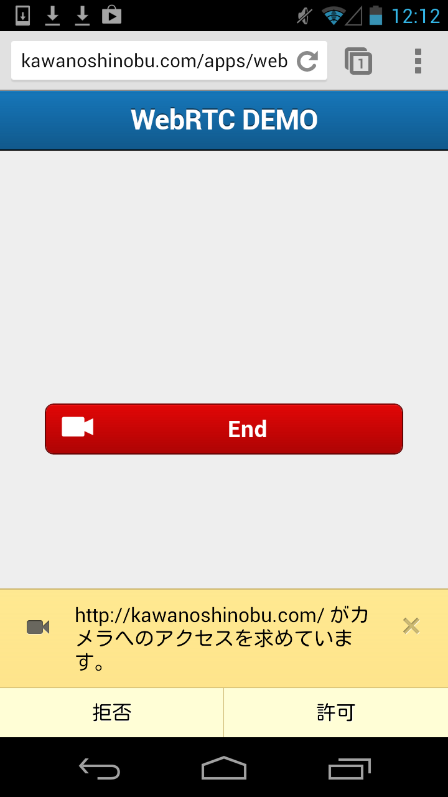
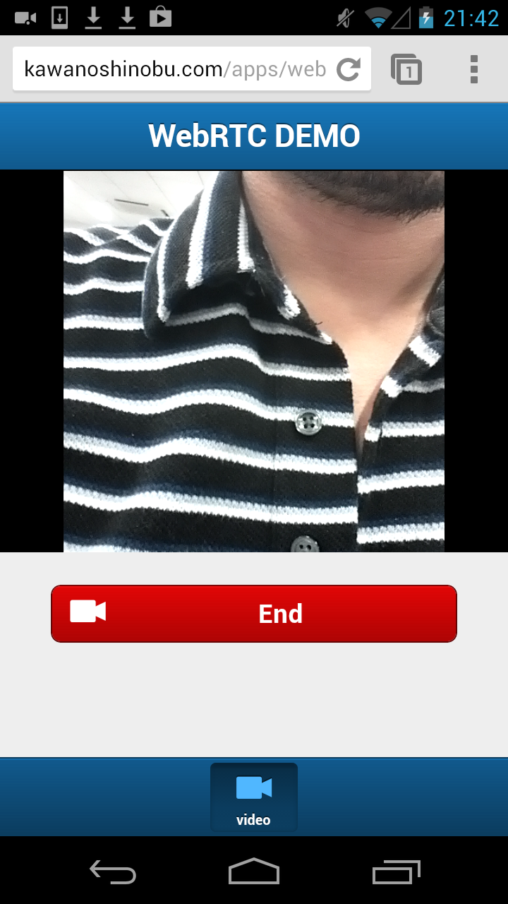
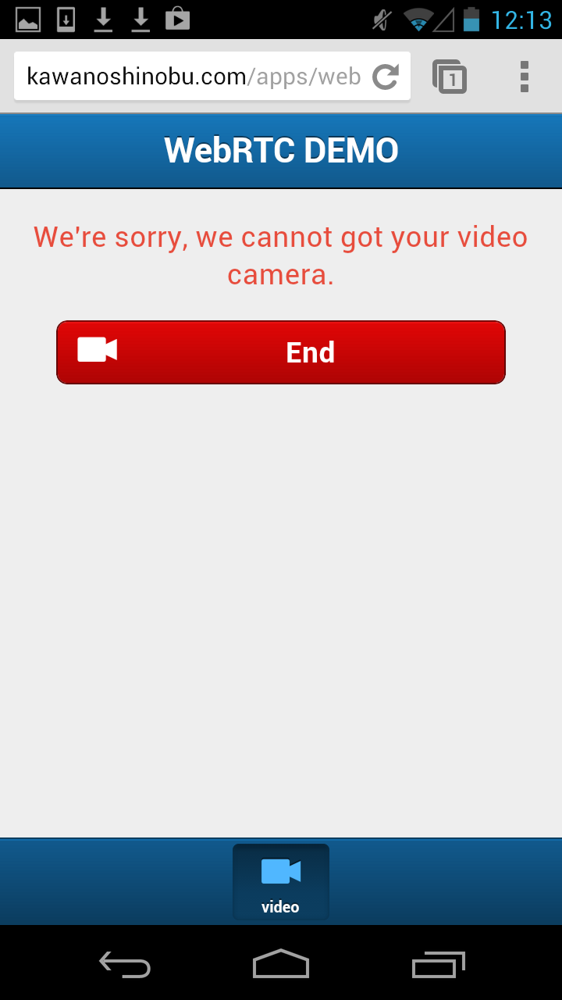

# Ext.ux.WebRTC

Custom component which wrapped WebRTC APIs for Sencha Touch 2.

## Note

This component works fine on Chrome for Android only.

## Getting Started

### Initialization

Place the 'ux' folder somewhere within your application, then add the following to your app (at the top of 'app.js' is a good place):

    Ext.Loader.setPath({
        'Ext': 'touch/src',
        'MyApp': 'app',
        'Ext.ux': 'ux'
    });

Adjust './ux' to wherever you actually placed the 'ux' folder.

Then in whatever component you wish to use the view, add:

    requires = [
        'Ext.ux.WebRTC',
    ]

Before build with Sencha Cmd, you must define "${add.dir}/ux" to sencha.cfg:

    app.classpath=${app.dir}/app.js,${app.dir}/ux,${app.dir}/app

### Example

Execute the following command in the sources root directory

    sencha ant -f project.xml initialize

Then to place example directory to server's application directory.

## Version

0.0.1

## license

Copyright (c) 2013 KAWANO Shinobu. This software is licensed under the MIT License.

